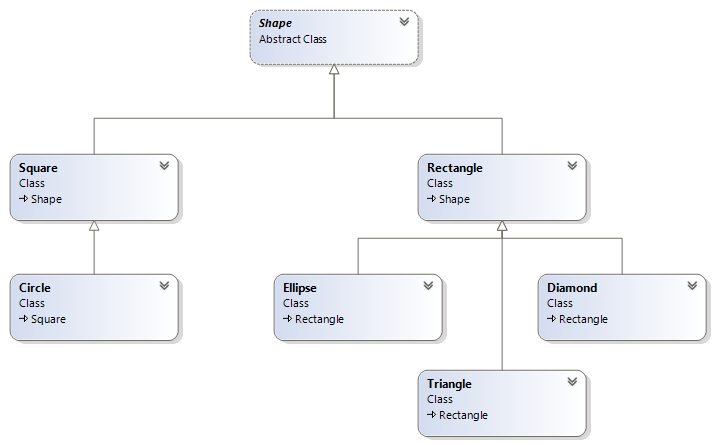

# The Shape class

This abstract class comprises of four members:

<table>
<colgroup>
<col style="width: 100%" />
</colgroup>
<thead>
<tr class="header">
<th><p><strong>Shape</strong></p>
<p><strong>Abstract Class</strong></p></th>
</tr>
</thead>
<tbody>
<tr class="odd">
<td><strong>Properties</strong></td>
</tr>
<tr class="even">
<td><p><strong>+ &lt;&lt;C# property protected set&gt;&gt;Name :
string</strong></p>
<p><strong>+ &lt;&lt;C# property abstract get&gt;&gt;Area :
double</strong></p></td>
</tr>
<tr class="odd">
<td><strong>Methods</strong></td>
</tr>
<tr class="even">
<td><p><strong>+ &lt;&lt;constructor&gt;&gt; <mark>Shape</mark>(string
name)</strong></p>
<p><strong>+ ToString() : string<br />
</strong></p></td>
</tr>
</tbody>
</table>



There are seven classes participating in this application as shown in
the diagram above. Each of the seven classes is fully described below.

You will need to “google” how to declare an abstract property.

Not all base classes are abstract

**Object** is the parent class of all classes and it is not abstract.

**Square** is the parent class of **Circle** and it is not abstract.

Similarly **Rectangle** is the parent class of **Ellipse**, **Triangle**
and **Diamond** and it is not declared abstract.

#### Description of class members

Some decorators for classes are

**abstract** it cannot be instantiated

**sealed** it cannot be the parent of any class

**static** all members are static, cannot be instantiated

**partial** type is fully implemented in multiple files

##### Fields:

There are no fields

##### Properties:

There are two properties in which one of them is auto-implemented.

**Name** – this string property represents the name of this object. The
getter is public and the setter is private.

**Area** – this property represents the area of this shape. This is an
abstract property that is implemented in the derived classes. There is
no set accessor.

##### Constructor:

**<span class="mark">Shape(string name)</span>** – This constructor
takes a string parameter and assigns it to the appropriate property.

##### Methods:

**public override string ToString()** – This is a public method
overrides the corresponding method in the object class to return the
Name and the Area of this object. You get to decide how the properties
will be display to the user.

It is possible to override a member in the base class that is decorated
with the virtual, abstract or override keyword

# The Square class

This class inherits from the Shape class and it comprises of three
members:

<table>
<colgroup>
<col style="width: 100%" />
</colgroup>
<thead>
<tr class="header">
<th><p><strong>Square</strong></p>
<p><strong>Class</strong></p>
<p><strong>Shape</strong></p></th>
</tr>
</thead>
<tbody>
<tr class="odd">
<td><strong>Properties</strong></td>
</tr>
<tr class="even">
<td><p><strong># &lt;&lt;C# property get, set&gt;&gt;Length :
double</strong></p>
<p><strong>+ &lt;&lt;C# property get&gt;&gt;Area :
double</strong></p></td>
</tr>
<tr class="odd">
<td><strong>Methods</strong></td>
</tr>
<tr class="even">
<td><strong>+ &lt;&lt;constructor&gt;&gt; <mark>Square</mark>(string
name, double length)</strong></td>
</tr>
</tbody>
</table>

#### Description of class members

##### Fields:

There are no fields

##### Properties:

There are two properties in which one of them is auto-implemented.

**Length** – this double property represents the length of this object.
The getter is public and the setter is protected.

**Area** – this property represents the area of this shape. This
property returns the square of the length.

##### Constructor:

**<span class="mark">Square(string name, double length)</span>** – This
constructor takes two parameter, it invokes the base constructor with
the first one and assigns the second one to the appropriate property.

##### Methods:

There are no methods

# The Circle class

This class inherits from the Square class and it comprises of three
members:

<table>
<colgroup>
<col style="width: 100%" />
</colgroup>
<thead>
<tr class="header">
<th><p><strong>Circle</strong></p>
<p><strong>Class</strong></p>
<p><strong>Square</strong></p></th>
</tr>
</thead>
<tbody>
<tr class="odd">
<td><strong>Properties</strong></td>
</tr>
<tr class="even">
<td><strong>+ &lt;&lt;C# property get&gt;&gt;Area : double</strong></td>
</tr>
<tr class="odd">
<td><strong>Methods</strong></td>
</tr>
<tr class="even">
<td><strong>+ &lt;&lt;constructor&gt;&gt; <mark>Circle</mark>(string
name, double length)</strong></td>
</tr>
</tbody>
</table>

#### Description of class members

##### Fields:

There are no fields

##### Properties:

There is a calculated property.

**Area** – this property represents the area of this shape. The getter
returns **π \* Length \* Length**.

##### Constructor:

**<span class="mark">Circle(string name, double length)</span>** – This
constructor takes two parameter, it invokes the base constructor with
both of them.

##### Methods:

There are no methods

# The Rectangle class

This class inherits from the Shape class and it comprises of three
members:

<table>
<colgroup>
<col style="width: 100%" />
</colgroup>
<thead>
<tr class="header">
<th><p><strong>Rectangle</strong></p>
<p><strong>Class</strong></p>
<p><strong>Shape</strong></p></th>
</tr>
</thead>
<tbody>
<tr class="odd">
<td><strong>Properties</strong></td>
</tr>
<tr class="even">
<td><p><strong># &lt;&lt;C# property get, set&gt;&gt;Width :
double</strong></p>
<p><strong># &lt;&lt;C# property get, set&gt;&gt;Height :
double</strong></p>
<p><strong>+ &lt;&lt;C# property get&gt;&gt;Area :
double</strong></p></td>
</tr>
<tr class="odd">
<td><strong>Methods</strong></td>
</tr>
<tr class="even">
<td><strong>+ &lt;&lt;constructor&gt;&gt; <mark>Rectangle</mark>(string
name, double height, double width)</strong></td>
</tr>
</tbody>
</table>

#### Description of class members

##### Fields:

There are no fields

##### Properties:

There are three properties.

**Width** – this double property represents the width of this object.
The getter is public and the setter is protected.

**Height** – this double property represents the height of this object.
The getter is public and the setter is protected.

**Area** – this property represents the area of this shape. The getter
returns **Width** **\* Height**.

##### Constructor:

**<span class="mark">Rectangle(string name, double length, double
width)</span>** – This constructor takes three parameters, it invokes
the base constructor with the first one the assigns the last two to the
appropriate properties.

##### Methods:

There are no methods

# The Ellipse class

This class inherits from the Rectangle class and it comprises of two
members:

<table>
<colgroup>
<col style="width: 100%" />
</colgroup>
<thead>
<tr class="header">
<th><p><strong>Ellipse</strong></p>
<p><strong>Class</strong></p>
<p><strong>Rectangle</strong></p></th>
</tr>
</thead>
<tbody>
<tr class="odd">
<td><strong>Properties</strong></td>
</tr>
<tr class="even">
<td><strong>+ &lt;&lt;C# property get&gt;&gt;Area : double</strong></td>
</tr>
<tr class="odd">
<td><strong>Methods</strong></td>
</tr>
<tr class="even">
<td><strong>+ &lt;&lt;constructor&gt;&gt; <mark>Ellipse</mark>(string
name, double height, double width)</strong></td>
</tr>
</tbody>
</table>

#### Description of class members

##### Fields:

There are no fields

##### Properties:

There is only one calculated property.

**Area** – this property represents the area of this shape. The getter
returns **π \* Width \* Height**.

##### Constructor:

**<span class="mark">Ellipse(string name, double height, double
width)</span>** – This constructor takes three parameters, it invokes
the base constructor with all of them.

##### Methods:

There are no methods

# The Triangle class

This class inherits from the Rectangle class and it comprises of two
members:

<table>
<colgroup>
<col style="width: 100%" />
</colgroup>
<thead>
<tr class="header">
<th><p><strong>Triangle</strong></p>
<p><strong>Class</strong></p>
<p><strong>Rectangle</strong></p></th>
</tr>
</thead>
<tbody>
<tr class="odd">
<td><strong>Properties</strong></td>
</tr>
<tr class="even">
<td><strong>+ &lt;&lt;C# property get&gt;&gt;Area : double</strong></td>
</tr>
<tr class="odd">
<td><strong>Methods</strong></td>
</tr>
<tr class="even">
<td><strong>+ &lt;&lt;constructor&gt;&gt; <mark>Triangle</mark>(string
name, double height, double width)</strong></td>
</tr>
</tbody>
</table>

#### Description of class members

##### Fields:

There are no fields

##### Properties:

There is only one calculated property.

**Area** – this property represents the area of this shape. The getter
returns **Width \* Height \* 0.5**.

##### Constructor:

**<span class="mark">Triangle(string name, double height, double
width)</span>** – This constructor takes three parameters, it invokes
the base constructor with all of them.

##### Methods:

There are no methods

# The Diamond class

This class inherits from the Rectangle class and it comprises of two
members:

<table>
<colgroup>
<col style="width: 100%" />
</colgroup>
<thead>
<tr class="header">
<th><p><strong>Diamond</strong></p>
<p><strong>Class</strong></p>
<p><strong>Rectangle</strong></p></th>
</tr>
</thead>
<tbody>
<tr class="odd">
<td><strong>Properties</strong></td>
</tr>
<tr class="even">
<td><strong>+ &lt;&lt;C# property get&gt;&gt;Area : double</strong></td>
</tr>
<tr class="odd">
<td><strong>Methods</strong></td>
</tr>
<tr class="even">
<td><strong>+ &lt;&lt;constructor&gt;&gt; <mark>Diamond</mark>(string
name, double height, double width)</strong></td>
</tr>
</tbody>
</table>

#### Description of class members

##### Fields:

There are no fields

##### Properties:

There is only one calculated property.

**Area** – this property represents the area of this shape. The getter
returns **Width \* Height \* 0.5**.

##### Constructor:

**<span class="mark">Diamond(string name, double height, double
width)</span>** – This constructor takes three parameters, it invokes
the base constructor with all of them.

##### Methods:

There are no methods

### Test Harness

Copy the following lines to the Main method in the Program.cs file.

``` cs
//although Shape is an abstract is can be used as a reference type
//any child class of Shape is also a Shape
List<Shape> shapes = new List<Shape>();

shapes.Add(new Square("s1", 2));
shapes.Add(new Rectangle("r1", 2, 3));
shapes.Add(new Circle("c1", 2));
shapes.Add(new Triangle("t1", 4, 6));
shapes.Add(new Ellipse("e1", 2, 3));
shapes.Add(new Diamond("d1", 2, 3));
shapes.Add(new Square("s2", 5));
shapes.Add(new Rectangle("r2", 5, 4));
shapes.Add(new Circle("c2", 1));
shapes.Add(new Triangle("t2", 7, 8));

foreach (var s in shapes)
{
    Console.WriteLine(s);
}
```
